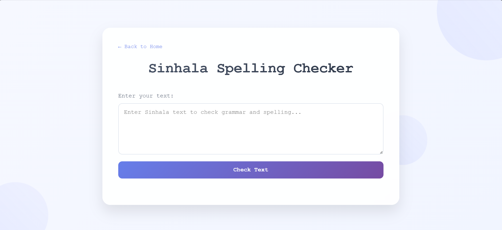

# Sinhala-Spelling-Corrector-and-Grammar-Checker

The **Sinhala Spell and Grammar Checker** is a rule-based tool designed to identify and correct spelling and grammatical errors in Sinhala text efficiently. By utilizing predefined rules, it ensures that Sinhala text is accurate, grammatically correct, and fluent.

---

## Features

- **Spelling Correction**: Detects and corrects misspelled Sinhala words.
- **Grammar Correction**: Identifies and corrects grammatical errors based on Sinhala language rules.
- **User-Friendly Interface**: Provides an intuitive interface for ease of use.
- **Efficient Error Handling**: Processes text quickly to provide instant corrections.

---

## Installation

1. Clone the repository:
   ```bash
   git clone https://github.com/yourusername/sinhala-spell-grammar-checker.git
   ```

2. Navigate to the project directory:
   ```bash
   cd sinhala-spell-grammar-checker
   ```

### Backend

3. Navigate to the backend directory:
   ```bash
   cd backend
   ```

4. Install the required dependencies:
   ```bash
   pip install -r requirements.txt
   ```

5. Run the backend application:
   ```bash
   python app.py
   ```

### Frontend

1. Navigate to the frontend directory:
   ```bash
   cd frontend
   ```

2. Install the required dependencies:
   ```bash
   npm install
   ```

3. Start the frontend application:
   ```bash
   npm start
   ```

---

## Usage

1. Open the application.
2. Input Sinhala text into the provided text area.
3. Click the **"Check"** button to identify errors.
4. Review and apply the suggested corrections.

---

## Screenshots

### 1. Home Screen


### 2. Spelling Checker Screen


### 3. Grammar Checker Screen


---

## Future Improvements

- **Advanced NLP Integration**: Leverage natural language processing techniques to improve error detection and correction accuracy.
- **Machine Learning Models**: Incorporate machine learning to enhance rule-based methods.
- **Real-Time Suggestions**: Provide suggestions as users type.

---

## License

This project is licensed under the MIT License. See the [LICENSE](LICENSE) file for details.

---

## Contact

For inquiries, suggestions, or feedback, please email us at **aroshupathilak@gmail.com**.